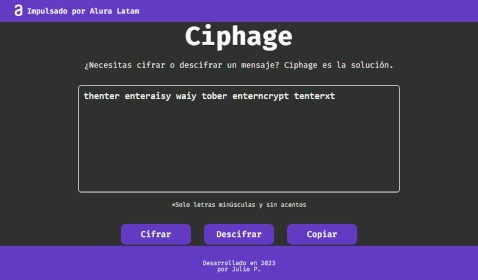

# Ciphage 🔒

  

## Description 📄

Ciphage is a web project powered by [Alura Latam](https://www.aluracursos.com/) that allows you to securely exchange secret messages using easy-to-use text encryption. It employs a vowel substitution technique with encryption keys to ensure the security of your messages. Keep your conversations private with Ciphage!

### 
Encryption Table

  <table>
    <thead>
      <tr>
        <th>Vowels</th>
        <th>Encryption Keys</th>
      </tr>
    </thead>
    <tbody>
      <tr>
        <td align="center">a</td>
        <td align="center">ai</td>
      </tr>
      <tr>
        <td align="center">e</td>
        <td align="center">enter</td>
      </tr>
      <tr>
        <td align="center">i</td>
        <td align="center">imes</td>
      </tr>
      <tr>
        <td align="center">o</td>
        <td align="center">ober</td>
      </tr>
      <tr>
        <td align="center">u</td>
        <td align="center">ufat</td>
      </tr>
    </tbody>
  </table>

## Usage 🚀

1. Access [Ciphage](https://juliopzsosa.github.io/Ciphage/) in your web browser.
2. Enter your message in the text field.
3. Click the "Cifrar" button to encrypt the message.
4. Click the "Descifrar" button to decrypt the message.
5. Use the "Copiar" button to copy the message to the clipboard.

## Contact 📬

If you have any questions or suggestions, feel free to contact me:

- GitHub: [juliopzsosa](https://github.com/juliopzsosa)
- LinkedIn: [Julio P.](https://www.linkedin.com/in/juliopzsosa/)

Thank you for using Ciphage! Keep your messages secure! 🔐
